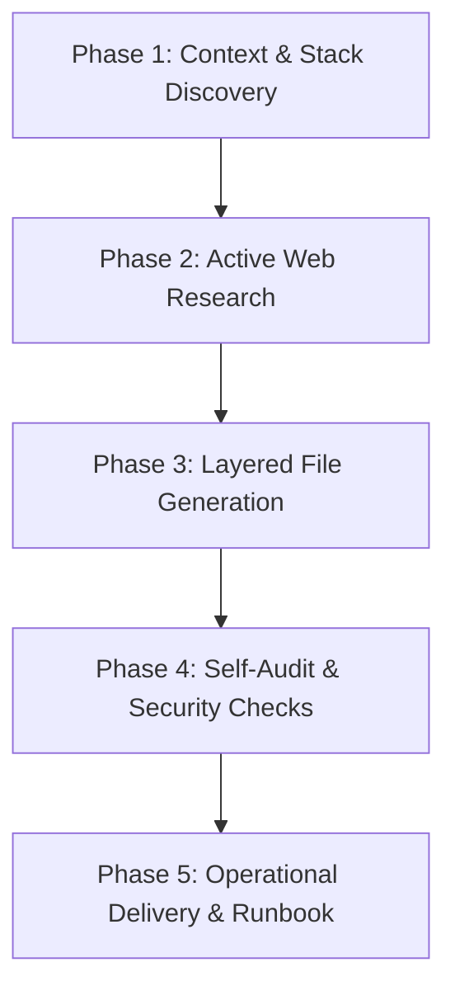

# Docker Specialist (2026 Standards)

This skill enables AI agents to design, construct, troubleshoot, and optimize robust, secure, and production-ready Docker environments across any technology stack.

---

## Non-Negotiable Directives

> [!IMPORTANT]
> **1. MANDATORY ACTIVE WEB RESEARCH BEFORE CONFIGURING UNFAMILIAR STACKS.**
> When handling unpinned base image versions, specialized runtime dependencies (e.g., PHP extensions, Python system libraries, native Node add-ons), or framework-specific output modes, execute targeted web searches (`search_web`) to retrieve the latest official recommendations and stable tags before writing code. See [Official Docs & Upstream Sources](references/official-docs-and-sources.md).

> [!IMPORTANT]
> **2. COMPOSE SPECIFICATION COMPLIANCE (NO OBSOLETE `version` FIELD).**
> Always use `compose.yaml` (or `compose.override.yaml`). Never include the deprecated top-level `version:` attribute (e.g. `version: "3.8"`), which is obsolete in modern Docker Compose. See [Compose Spec Reference](references/compose-spec.md).

> [!IMPORTANT]
> **3. LEAST-PRIVILEGE SECURITY & BUILDKIT OPTIMIZATIONS.**
> - **Non-root Execution:** Never run production applications as `root`. Explicitly create and switch to a dedicated non-root user (`USER appuser`).
> - **BuildKit Cache Mounts:** Always accelerate dependency steps (`npm ci`, `pip install`, `composer install`) with `--mount=type=cache`.
> - **Secret Mounts:** Never pass credentials via `ARG` or `ENV`. Use `--mount=type=secret`.
> See [Dockerfile Mastery](references/dockerfile-mastery.md).

> [!IMPORTANT]
> **4. HEALTHCHECK-DRIVEN ORCHESTRATION.**
> In `compose.yaml`, services depending on databases or caches must never rely on bare `depends_on`. Always configure a robust `healthcheck` on the dependency and declare `depends_on: { <service>: { condition: service_healthy } }`.

> [!IMPORTANT]
> **5. CONTEXT PROTECTION BEFORE DOCKERFILE.**
> Always create or update `.dockerignore` before or alongside the `Dockerfile` to prevent uploading secrets (`.env*`, keys), repositories (`.git`), and local modules (`node_modules/`, `vendor/`) to the Docker daemon. See [.dockerignore Patterns](references/dockerignore-patterns.md).

> [!IMPORTANT]
> **6. STRICT RELATIVE PATHS FOR SKILL PORTABILITY.**
> All internal links to references or templates within this skill must use clean relative markdown paths (e.g., `[Dockerfile Mastery](references/dockerfile-mastery.md)`). Never use hardcoded absolute system paths.

---

## Procedural Workflow



### Phase 1: Context & Stack Discovery
1. Inspect project manifests: `package.json`, `composer.json`, `requirements.txt`, `go.mod`, etc.
2. Determine runtime version, exposed ports, required environment variables, background workers, and persistent data directories.
3. Check for existing container files (`Dockerfile`, `docker-compose.yml`, `.dockerignore`) and identify deprecations or errors.

### Phase 2: Active Web Research & Verification
If base image tags, framework deployment modes (e.g. Next.js Standalone), or native libraries are uncertain:
1. Execute `search_web` with specific queries (e.g., `"docker hub node alpine official tags"`, `"nextjs standalone dockerfile 2026"`).
2. Consult the verified source list in [Official Docs & Upstream Sources](references/official-docs-and-sources.md).

### Phase 3: Layered File Generation
Generate container files in strict operational order:
1. **`.dockerignore`**: Exclude `.git`, `.env*`, build caches, and local dependencies. Refer to [.dockerignore Patterns](references/dockerignore-patterns.md).
2. **`Dockerfile` / `Dockerfile.dev`**:
   - Determine target environment: generate `Dockerfile.dev` for fast live-reload (`next dev`, Turbopack, HMR) or multi-stage `Dockerfile` for standalone production releases.
   - Add `# syntax=docker/dockerfile:1`.
   - BuildKit cache mounts (`--mount=type=cache`) for package installations.
   - Non-root user declaration (`USER appuser` / `USER nextjs`).
   - JSON array execution form `CMD ["executable", "param"]`.
   - See [Dockerfile Mastery](references/dockerfile-mastery.md).
3. **`compose.yaml`**:
   - Omit obsolete `version:`.
   - Use hierarchical `env_file` (`.env` as base, `.env.local` as override, both with `required: false`).
   - Explicitly define `container_name:` and `image:` for ergonomics.
   - Configure healthchecks on databases and background services.
   - Use `condition: service_healthy` on dependent services.
   - Configure named volumes for persistent data and bridge networks for isolation.
   - Configure `develop.watch` for live-reloading dev workflows (`docker compose watch <service>`).
   - See [Compose Spec Reference](references/compose-spec.md) and [Stacks Matrix](references/stacks-ecosystem-matrix.md).

### Phase 4: Self-Audit & Security Checks
Audit generated files against critical failure modes:
- [ ] Is `.dockerignore` present and excluding `.env*` and `.git`?
- [ ] Does the runner stage execute as a non-root user?
- [ ] Are dependencies installed before source code is copied (cache preservation)?
- [ ] Are all database dependencies verified with `service_healthy`?
- [ ] Are host ports mapped safely without collisions?
- [ ] For errors and troubleshooting, consult [Troubleshooting & Diagnostics](references/troubleshooting-and-diagnostics.md).

### Phase 5: Operational Delivery & Runbook
Provide the user with exact commands to start, inspect, and verify the environment:
```bash
# 1. Start live development with automatic synchronization
docker compose watch app

# 2. Build and start services in background
docker compose up --build -d

# 3. Verify service health status
docker compose ps

# 4. Follow application logs
docker compose logs -f <service_name>
```

---

## Canonical Examples

### Scenario 1: Next.js Standalone + Dev Mode (`Dockerfile.dev`) + PostgreSQL
- **User Prompt:** `"Crie um ambiente Docker para Next.js com live reload, banco Postgres e pronto para build standalone."`
- **Agent Action:**
  1. Inspects `next.config.ts` (or `next.config.js`) to ensure `output: 'standalone'` is declared.
  2. Creates `.dockerignore` excluding `.next/`, `node_modules/`, `.git/`, `.env*`.
  3. Creates `Dockerfile.dev` (optimized for `npm run dev`, Fast Refresh, and cache mounts) and multi-stage `Dockerfile` (standalone production runner).
  4. Creates `compose.yaml` with:
     - `container_name: nextjs-app` e `image: nextjs-app:dev`.
     - `env_file: [ { path: .env, required: false }, { path: .env.local, required: false } ]`.
     - `develop.watch` for real-time synchronization of `./src` and `./public`.
     - PostgreSQL 17 with `healthcheck: ["CMD-SHELL", "pg_isready ..."]` and persistent volume `pgdata`.
  5. Delivers runbook: `docker compose watch app` (dev) and `docker compose up --build -d`.
  - Reference Template: [Next.js Template](templates/nextjs-standalone/compose.yaml) & [Dockerfile.dev](templates/nextjs-standalone/Dockerfile.dev).

### Scenario 2: WordPress + PHP-FPM + Nginx + MariaDB
- **User Prompt:** `"Configure um ambiente Docker seguro para WordPress com Nginx e MariaDB."`
- **Agent Action:**
  1. Creates `.dockerignore` protecting local uploads and secrets.
  2. Crafts `Dockerfile` extending `wordpress:fpm-alpine` with GD, Zip, OPcache, and custom upload limits.
  3. Writes `nginx.conf` with FastCGI routing and rewrite rules.
  4. Creates `compose.yaml` with MariaDB healthcheck, named volumes (`db_data`, `wp_data`), and isolated backend network.
  - Reference Template: [WordPress LEMP Template](templates/wordpress-lemp/compose.yaml).

### Scenario 3: Debugging Database Race Condition & Permissions
- **User Prompt:** `"Meu backend Node dá erro ECONNREFUSED ao conectar no Postgres durante o docker compose up."`
- **Agent Action:**
  1. Identifies that `depends_on: [db]` only waits for container start, not socket readiness.
  2. Adds `healthcheck: test: ["CMD-SHELL", "pg_isready -U $$POSTGRES_USER -d $$POSTGRES_DB"]` to PostgreSQL.
  3. Updates backend service to `depends_on: { db: { condition: service_healthy } }`.
  4. Ensures host is set to the service name (`db:5432`), not `localhost:5432`.
  - Reference Guide: [Troubleshooting & Diagnostics](references/troubleshooting-and-diagnostics.md).

---

## References & Starter Templates

### Deep Knowledge Guides
- [Dockerfile Mastery & BuildKit](references/dockerfile-mastery.md)
- [Compose Specification Reference](references/compose-spec.md)
- [.dockerignore Patterns & Context Rules](references/dockerignore-patterns.md)
- [Stacks & Ecosystem Matrix (Node, PHP, Python, Go, DBs)](references/stacks-ecosystem-matrix.md)
- [Troubleshooting & Diagnostic Triage](references/troubleshooting-and-diagnostics.md)
- [Official Documentation & Search Formulas](references/official-docs-and-sources.md)

### Production Starter Templates
- [Next.js Standalone & Dev Template](templates/nextjs-standalone/compose.yaml)
- [WordPress LEMP Stack Template](templates/wordpress-lemp/compose.yaml)
- [Node.js API Template](templates/nodejs-api/compose.yaml)
- [Database Services Recipes (Postgres, MariaDB, Mongo, Redis)](templates/database-services/compose-dbs.yaml)

