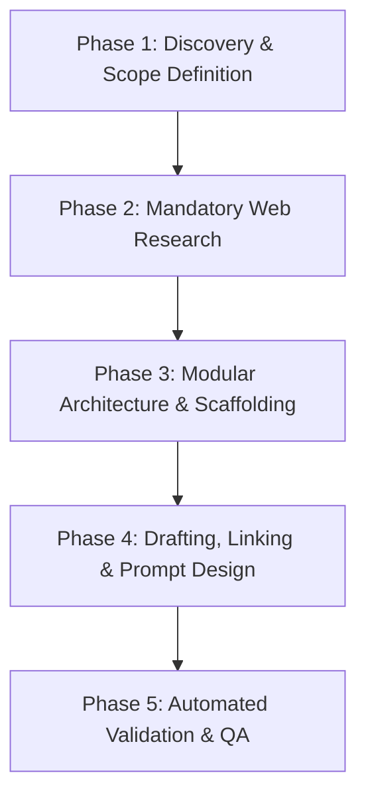

# Skill Creator & Architect (2026 Standards)

This skill guides AI agents through the process of planning, researching, architecting, drafting, and validating high-performance, portable AI agent skills.

---

## Primary & Non-Negotiable Directives

> [!IMPORTANT]
> **1. ALWAYS PERFORM ACTIVE WEB SEARCHES BEFORE CREATING OR REFINING ANY SKILL.**
> Every skill must be grounded in the latest technical documentation, standards, and community best practices. Before drafting or modifying a `SKILL.md`, execute targeted internet searches (`search_web`) to collect:
> - Official documentation and latest API/tool version specifications.
> - Ecosystem best practices and state-of-the-art prompt/skill design patterns in 2026.
> - Common pitfalls, gotchas, deprecated CLI flags, and performance traps.
> - Real-world canonical examples and domain-specific edge cases.

> [!IMPORTANT]
> **2. STRICT RELATIVE PATHS FOR SKILL PORTABILITY (NO HARDCODED ABSOLUTE PATHS).**
> All links and references to files within the skill package (`references/`, `templates/`, `scripts/`) **MUST** use clean relative markdown links (e.g., `[Guide](references/guide.md)` or `[Template](templates/template.md)`).
> **NEVER** use hardcoded absolute system paths (e.g., `file:///C:/...` or `/home/...`). Skills must remain 100% portable across different workspaces, users, and operating systems.

---

## Core Pillars of High-Performance Agent Skills

When building or refining any skill, strictly adhere to these 5 foundational pillars:

1. **Progressive Disclosure (Context On-Demand):**
   - The primary `SKILL.md` must be concise, high-density, and procedural.
   - Deep reference manuals, extensive schema tables, and cheatsheets belong in `references/`.
   - Fragile, repetitive, or mechanical tasks belong in `scripts/`.
   - Canonical examples and starter files belong in `templates/` or `examples/`.
   - All internal links must be relative to the skill's root folder.

2. **Precision Positive & Negative Triggering:**
   - The YAML frontmatter `description` must be phrased in **3rd person** and explicitly define both **when to activate** and **when NOT to activate**, preventing accidental context pollution.

3. **Deterministic Harness vs. Probabilistic Reasoning:**
   - Offload deterministic tasks (schema validation, link checking, scaffolding, code linting) to deterministic scripts (Python/Node).
   - Reserve LLM context and reasoning for synthesis, design decisions, architectural reviews, and high-level orchestration.

4. **Canonical Examples over "Laundry Lists":**
   - Do not overwhelm the prompt with endless negative rules and edge cases. Provide 1–2 well-crafted canonical examples (*few-shot*) illustrating ideal behavior.

5. **Explicit Success Criteria & Automated Validation:**
   - Every skill must have measurable acceptance criteria and an automated validation step to verify structural, metadata, and link integrity.

---

## 5-Phase Skill Creation Workflow



### Phase 1: Discovery & Scope Definition
- Identify the user's specific domain requirements, operational scope, and target tool ecosystem.
- Define a canonical, kebab-case skill identifier (e.g., `github-actions-specialist`, `seo-auditor`, `db-migration-expert`).
- Establish strict boundaries: clearly delineate what the skill solves versus what is explicitly out of scope.

### Phase 2: Active Web Research (Mandatory)
- Execute targeted `search_web` queries tailored to the domain (e.g., `"best practices <domain> 2026"`, `"<tool> cli latest options"`, `"prompt engineering patterns for agent skills"`).
- Extract authoritative recommendations, CLI syntax, configuration rules, and security guidelines.

### Phase 3: Modular Architecture & Scaffolding
Organize the skill directory following standard progressive disclosure with relative structure:
```text
.agents/skills/<skill-name>/
├── SKILL.md                          # Master procedural instruction & entry point
├── references/                       # In-depth guides, specifications, API docs
│   └── domain-guide.md
├── scripts/                          # Deterministic automation & validation scripts
│   └── helper_tool.py
└── templates/                        # Ready-to-use boilerplate templates
    └── standard-template.md
```

### Phase 4: Drafting & Prompt Design
1. **YAML Frontmatter:**
   - Ensure clean YAML headers with precise `name` and `description`.
   - See [frontmatter-spec.md](references/frontmatter-spec.md).
2. **Body Structure & Directives:**
   - **Title & Overview:** Direct summary of the skill's purpose.
   - **Non-Negotiable Directives:** Highlight critical constraints with GitHub alerts (`> [!IMPORTANT]`, `> [!WARNING]`).
   - **Step-by-Step Workflow:** Ordered procedural steps with clear checkpoints.
   - **Relative Links:** Link to internal resources using relative paths (e.g., `[API Spec](references/api-spec.md)`).
   - **Canonical Examples:** Concrete few-shot scenarios demonstrating expected input/output.
   - See [prompt-patterns.md](references/prompt-patterns.md).

### Phase 5: Automated Validation & QA
- Run the structural validator script:
  ```powershell
  python .agents/skills/skill-creator/scripts/validate_skill.py .agents/skills/<skill-name>/SKILL.md
  ```
  *(or via Node: `node .agents/skills/skill-creator/scripts/validate_skill.js .agents/skills/<skill-name>/SKILL.md`)*
- Verify that `SKILL.md` remains lean (< 400 lines); offload reference material to `references/`.
- Ensure all markdown links are relative and resolve properly without broken references.

---

## Quick References & Tooling

- [2026 Best Practices for Agent Skills](references/best-practices-2026.md)
- [Frontmatter Specification & Trigger Optimization](references/frontmatter-spec.md)
- [Prompt Design Patterns for Skills](references/prompt-patterns.md)
- [Standard Skill Template](templates/standard-skill-template.md)
