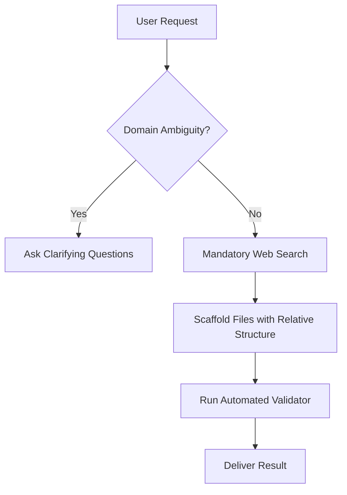

# Prompt Design Patterns for Agent Skills

Structured, clear, and unambiguous prompt design ensures that the AI agent follows the skill's instructions reliably without hallucinating or skipping critical steps.

---

## 1. Standard Hierarchical Section Architecture

A well-structured `SKILL.md` uses a predictable hierarchy to facilitate parsing by the model:

```text
# Skill Title & Domain

## Non-Negotiable Directives / Critical Alerts
  (Use GitHub Alerts: > [!IMPORTANT], > [!WARNING])

## Core Workflow / Sequential Execution Steps
  (Numbered steps with actionable sub-tasks)

## Tooling & Automation Integration
  (When and how to call deterministic scripts or specific tools)

## Canonical Few-Shot Examples
  (Concrete input/output demonstrations)

## Verification Checklist / Acceptance Criteria
  (Objective validation steps before completing the task)

## Related References
  (Clickable relative links to files in references/ and templates/)
```

---

## 2. GitHub-Style Alert Semantics

Use alert blocks strategically to establish rigid constraints:

- `> [!IMPORTANT]` : Mandatory procedural rules (e.g., "Must run web search first", "Must use relative links only", "Must run tests before committing").
- `> [!WARNING]` : Potential breaking changes, security vulnerabilities, or anti-patterns.
- `> [!NOTE]` : Contextual background, rationale, or default fallback behavior.
- `> [!TIP]` : Token optimization, performance tricks, or recommended flags.

---

## 3. Decision Trees & Step Diagrams

When the skill involves branching logic or multi-phase operations, use Mermaid diagrams to ground the agent's spatial understanding:



---

## 4. Canonical Example Design (Few-Shot Pattern)

When writing examples in skills, provide concise, end-to-end demonstrations:

### Example Pattern:
```markdown
### Canonical Scenario: Creating a DB Migration Skill

**Input / Trigger:**
"User asks: 'Create a skill to handle PostgreSQL database migrations using Flyway.'"

**Execution Steps:**
1. Execute web search: `search_web("Flyway PostgreSQL best practices 2026 CLI syntax")`.
2. Scaffold directory: `.agents/skills/flyway-migration-expert/`.
3. Draft `SKILL.md` with relative links to `references/naming-conventions.md`.
4. Run `validate_skill.py`.

**Expected Output Structure:**
- `.agents/skills/flyway-migration-expert/SKILL.md` created with valid frontmatter and relative links.
- Reference guide added at `references/naming-conventions.md`.
```

---

## 5. Relative Links vs. Hardcoded Absolute Paths

Always enforce relative markdown links for all internal references within a skill:
- ✅ `[Configuration Guide](references/config.md)`
- ✅ `[Starter Template](templates/component-template.md)`
- ❌ `[Configuration Guide](file:///C:/Users/.../references/config.md)` *(Anti-pattern: Non-portable)*

---

## 6. Avoiding Common Anti-Patterns

| Anti-Pattern | Why it Fails | Solution |
| :--- | :--- | :--- |
| **Hardcoded Machine Paths** (`file:///...`) | Breaks skill portability across users and environments. | Use clean relative paths (`references/guide.md`). |
| **Vague Admonitions** (`"Be very careful and make no mistakes"`) | Ignored by models; provides no actionable instruction. | Specify concrete validation criteria and tests. |
| **Embedded Giant Code Listings** | Bloats `SKILL.md` context window. | Move code into `templates/` or `references/`. |
| **Ambiguous Tool Descriptions** | Model misinterprets tool parameters or flags. | Provide exact CLI invocation templates. |
| **Unbounded Scope** | Skill tries to do everything, causing reasoning confusion. | Break into modular sub-skills with clear boundaries. |
