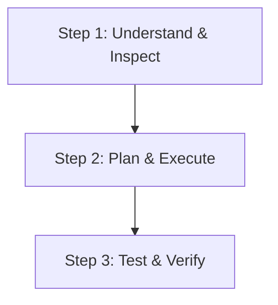

# <Skill Title in English>

<Brief overview of what this skill enables the agent to accomplish with high precision.>

---

## Non-Negotiable Directives

> [!IMPORTANT]
> - **Directives:** State mandatory rules that must be executed without exception.
> - **Pre-execution Checks:** Specify prerequisites or mandatory search/inspections before taking action.
> - **Relative File Links:** All references to files inside this skill must use relative markdown paths (e.g., `[Guide](references/guide.md)`). Never use hardcoded absolute system paths.

> [!WARNING]
> - **Critical Pitfalls:** Identify common failure modes, breaking changes, or anti-patterns to strictly avoid.

---

## Procedural Workflow

### Step 1: Requirements & Context Inspection
- Analyze the user request against the project constraints.
- Verify environment, tools, and prerequisite configurations.

### Step 2: Implementation & Execution
- Apply domain-specific design patterns.
- Keep changes modular and adhere to progressive disclosure.

### Step 3: Verification & Quality Assurance
- Run automated tests or deterministic verification scripts.
- Review output against success criteria.

---

## Canonical Examples

### Canonical Scenario: [Primary Use Case Title]
- **User Prompt:** `"[Example user prompt]"`
- **Agent Behavior:**
  1. Inspects relevant files.
  2. Executes targeted tools/commands.
  3. Formats response using structured markdown.
- **Expected Outcome:** `[Specific measurable result]`

---

## References & Resources

- [Domain Reference Guide](references/guide.md)
