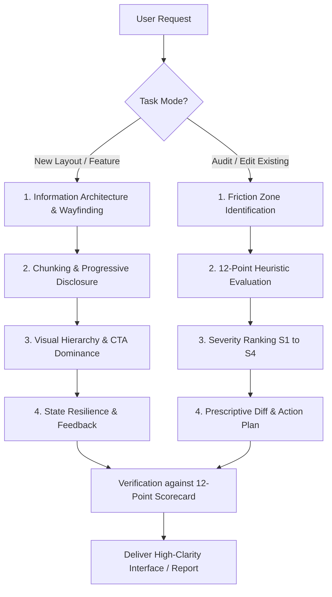

# UX Cognitive Optimizer & Clarity Architect

This skill guides AI agents in engineering low-friction, cognitively efficient user interfaces. It actively prevents visual hierarchy breakdowns, contextual disorientation, and extraneous cognitive overload across new designs and existing interface refactors.

---

## Non-Negotiable Directives

> [!IMPORTANT]
> - **The 5-Second Focal Anchor:** Every screen or modal must possess a single, unambiguous primary focal point and CTA. If two actions compete for equal visual weight, rebalance them immediately.
> - **Recognition Over Recall:** Never force the user to memorize data, IDs, or configurations across steps. Always preserve state and provide contextual inline cues or sticky summaries.
> - **Information Chunking (Miller's & Hick's Laws):** Restrict simultaneous options or unbounded fields to 3–5 items per semantic container. Use progressive disclosure for secondary controls.

> [!WARNING]
> - **No Visual Cages or Monochromatic Text:** Avoid indiscriminate dark borders and flat font sizing. Use subtle background contrast and disciplined typographic scale (weight/color) to establish hierarchy.
> - **No Destructive Context Loss:** Never reset form inputs, active filters, or scroll anchors upon validation failure or modal closure.

---

## Dual-Mode Procedural Workflow

---

### Mode A: Creating New Layouts & Interaction Flows

1. **Step 1: Contextual Anchoring & Wayfinding**
   - Establish clear breadcrumbs, page headers, or step indicators so the user's location is self-evident.
   - See [Contextual Continuity Guide](references/contextual-continuity-guide.md).

2. **Step 2: Information Chunking & Progressive Disclosure**
   - Group related inputs into cards or sections (`8px` item gap, `24px` section gap).
   - Offload secondary or advanced configurations into accordions, drawers, or multi-step wizards.
   - See [Progressive Disclosure Patterns](templates/progressive-disclosure-pattern.md).

3. **Step 3: Visual Hierarchy & Affordance Assignment**
   - Assign typographic scale: Display Title > Section Header > Body > Muted Meta.
   - Apply the Von Restorff effect: Reserve the primary brand color strictly for the main CTA button.
   - See [Visual Hierarchy Framework](references/visual-hierarchy-framework.md).

4. **Step 4: Cognitive Load Reduction & Smart Defaults**
   - Pre-populate common choices, apply autofill tokens, and support auto-detection.
   - Implement inline validation with immediate error resolution guidance.
   - See [Cognitive Load Heuristics](references/cognitive-load-heuristics.md).

---

### Mode B: Auditing & Refactoring Existing Interfaces

1. **Step 1: Screen & Workflow Inspection**
   - Scan the layout for clutter, low-contrast text, crowded tables, wall-of-fields forms, or competing CTAs.

2. **Step 2: Scorecard Assessment (12-Point Matrix)**
   - Score the interface against the 12 heuristics across Visual Hierarchy, Contextual Continuity, and Extrinsic Load.
   - See [UX Audit Scorecard](references/ux-audit-scorecard.md).

3. **Step 3: Severity Categorization (S1–S4)**
   - Tag each finding with its severity rating: `S4 (Blocker)`, `S3 (Major Cognitive Tax)`, `S2 (Minor Friction)`, `S1 (Cosmetic)`.

4. **Step 4: Prescriptive Code/Layout Refactor**
   - Generate the audit report following the [UX Audit Report Template](templates/ux-audit-report-template.md).
   - Provide concrete before/after code diffs resolving the friction points directly.

---

## Canonical Examples

### Scenario 1: Refactoring a Congested Multi-Field Settings Page (Audit Mode)

**User Input:**
> "Review this settings form: it has 25 inputs on a single page, two identical blue buttons for 'Save Draft' and 'Publish Now', and users complain it's overwhelming."

**Agent Execution:**
1. **Identified Violations:**
   - Heuristic #10 (Choice Minimization): 25 unchunked fields causing high extrinsic load.
   - Heuristic #1 (5-Second Focal Anchor): Two identical primary buttons causing decision paralysis.
2. **Prescribed Intervention:**
   - Chunk fields into 3 logical tabs/cards (*General*, *Integrations*, *Permissions*).
   - Demote "Save Draft" to secondary outline button; keep "Publish Now" as the sole primary CTA.
   - Move advanced developer API tokens into a collapsible accordion.
3. **Output:** Deliver structured UX Audit Report with severity breakdown (S3) and clean component code diff.

---

### Scenario 2: Designing a Multi-Step Checkout Flow (Creation Mode)

**User Input:**
> "Design a checkout experience for our SaaS subscription with team seat selection and tax billing."

**Agent Execution:**
1. **Wayfinding:** Incorporates a 3-step breadcrumb stepper (*1. Plan & Seats → 2. Billing & Tax → 3. Confirmation*).
2. **Recognition over Recall:** Retains a sticky right-side Order Summary card showing selected seats and live subtotal calculation.
3. **Smart Defaults:** Pre-selects monthly/annual toggle based on the most popular tier with an inline discount pill (`Save 20%`).
4. **Output:** Provides semantic, accessible HTML/CSS adhering to [Progressive Disclosure Patterns](templates/progressive-disclosure-pattern.md).

---

## References & Templates

- [Cognitive Load Heuristics & UX Laws](references/cognitive-load-heuristics.md)
- [Visual Hierarchy & Scanning Framework](references/visual-hierarchy-framework.md)
- [Contextual Continuity & State Preservation](references/contextual-continuity-guide.md)
- [UX Audit Scorecard & Heuristic Matrix](references/ux-audit-scorecard.md)
- [UX Audit Report Template](templates/ux-audit-report-template.md)
- [Progressive Disclosure Layout Patterns](templates/progressive-disclosure-pattern.md)
