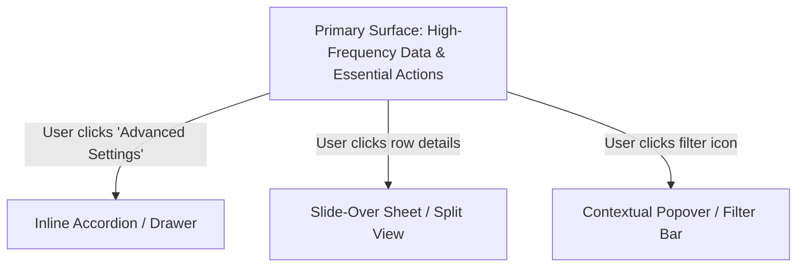

# Contextual Continuity & State Preservation Guide

Contextual continuity ensures that the user's mental model and flow remain unbroken as they navigate, input data, and complete tasks across an application.

---

## 1. What is Contextual Disconnection?

Contextual disconnection occurs when an interface forces a cognitive reset—making the user reorient themselves, lose track of their current progress, or re-enter information.

### Primary Causes of Disconnection:
1. **Spatial Amnesia:** Navigating to a sub-screen with no breadcrumb or back link indicating origin.
2. **Context Loss via Modal Overlays:** Full-screen dialogs covering critical reference information needed to answer the dialog.
3. **Destructive State Clears:** Inadvertently resetting filter parameters, form drafts, or scroll positions upon error or page transition.
4. **Disconnected Action Placements:** Placing actions far away from the relevant data (e.g., table bulk actions located 800px away from selected rows).

---

## 2. Wayfinding & Spatial Signposting

Users must always possess situational awareness:

```text
[ Global Location: Workspace / Team ]
         └── [ Section: Billing & Invoices ]
                  └── [ Current Focus: Invoice #INV-2026-089 ]
```

### Signposting Requirements:
- **Hierarchical Breadcrumbs:** Provide clickable breadcrumbs with explicit labels on all deep pages (e.g., `Projects > Website Redesign > Wireframes`).
- **Active Navigation Indicator:** Clearly highlight the current active route/tab in sidebar or top bar with distinct contrast and indicator line.
- **Linear Step Progress Indicators:** For multi-step procedures (wizards, setups), display:
  - Step Number and Label (e.g., *Step 2 of 4: Payment Details*).
  - Completed status for past steps (allowing one-click navigation back).
  - Explicit visual distinction between Completed, Current, and Upcoming steps.

---

## 3. Progressive Disclosure Architectural Patterns

Progressive disclosure reduces immediate visual load by revealing advanced or secondary details only upon user demand.



### 4 Core Progressive Disclosure Patterns:

1. **Inline Expansion (Accordion / Truncation):**
   - *Use Case:* Long descriptive text, optional form fields, nested child logs.
   - *Advantage:* Zero page transition; maintains overall spatial anchor.

2. **Slide-Over Drawer / Sheet:**
   - *Use Case:* Editing a specific record, viewing deep analytics of a table row.
   - *Advantage:* Preserves background table context while dedicating focus to detail editing.

3. **Contextual Floating Toolbar:**
   - *Use Case:* Actions triggered upon selecting 1 or more items in a list/canvas.
   - *Advantage:* Appears directly adjacent to selection, respecting Fitts's Law.

4. **Multi-Step Guided Flow (Wizard):**
   - *Use Case:* Setup procedures with > 7 fields and distinct cognitive stages.
   - *Advantage:* Chunks cognitive effort into single-topic focus units.

---

## 4. State Preservation & Feedback

### A. Draft & Input Resilience
- **Form Persistence:** Auto-save form drafts to local storage or session cache to prevent accidental loss on disconnect or back navigation.
- **Filter & Pagination Memory:** Preserve active search queries, filters, and sort orders in the URL query string (`?status=active&sort=desc`) so users can share, bookmark, or refresh without context loss.

### B. Optimistic UI & Transition Feedback
- **Optimistic State Updates:** Instantly render UI state changes (e.g., toggling a switch, starring an item) while backend synchronization completes in the background.
- **Inline Skeleton Loaders:** Use layout-matching skeleton screens rather than generic full-page spinners to maintain spatial grounding during data fetches.
- **Non-Destructive Error Recovery:** When validation fails, highlight the specific fields inline while retaining all user-entered text untouched.
