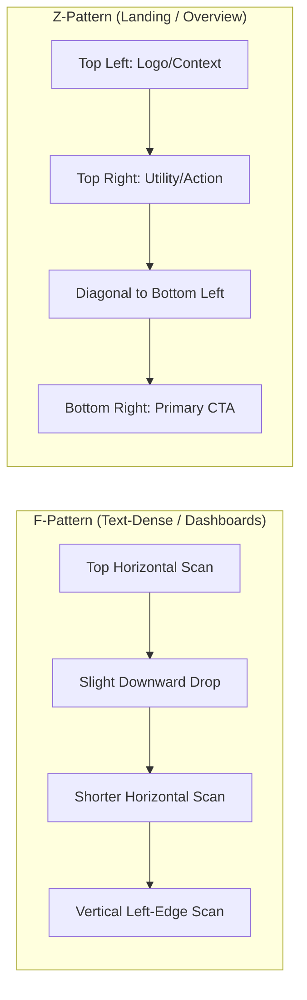

# Visual Hierarchy & Information Scanning Framework

Visual hierarchy acts as the visual narrative spine of an interface. It directs the user's focal path, enabling sub-second comprehension without conscious mental parsing.

---

## 1. The 5-Second Focal Point Rule

Within 5 seconds of landing on any view, a user must instantly discern:
1. **Where am I?** (Clear context title/breadcrumb).
2. **What is the most important information?** (Dominant focal element).
3. **What is the primary action expected of me?** (Single prominent CTA).

If multiple elements scream for equal attention simultaneously, visual hierarchy is broken.

---

## 2. Typographic Scale & Semantic Weight

Avoid arbitrary font sizes. Use a disciplined modular scale (e.g., Major Third 1.25x or Perfect Fourth 1.333x).

```text
Display Title (28–32px, Bold)   ───> Level 1 Anchor (Page Purpose)
  Section Header (20–24px, Semi) ───> Level 2 Anchor (Group Identity)
    Subhead / Label (14–16px, Med) ─> Level 3 (Field/Item Name)
      Body Text (14–16px, Regular) ──> Content (Informational)
        Caption / Meta (12px, Muted) ─> Secondary Meta (Dates, IDs)
```

### Hierarchy Rules:
- **Maximum 3 Font Sizes per Component:** Limit visual entropy inside cards or widgets.
- **Weight over Size:** Differentiate headers and body text via font-weight (`600`/`700` vs `400`) and color contrast rather than solely increasing point size.
- **Line Length & Leading:** Maintain 45–75 characters per line for body copy with `1.5` line-height for effortless scanning.

---

## 3. Gestalt Grouping Laws for Layout

| Principle | Visual Mechanism | Cognitive Benefit | Implementation Pattern |
| :--- | :--- | :--- | :--- |
| **Law of Proximity** | Elements closer together are perceived as a related unit. | Reduces cognitive grouping effort. | Space between related items (e.g., label + input: `8px`) must be significantly smaller than space between sections (`24px`–`32px`). |
| **Law of Common Region** | Elements enclosed within a boundary are perceived as unified. | Explicitly defines mental boundaries. | Use subtle cards, background fills (`surface-subtle`), or lightweight borders (`1px solid var(--border)`). |
| **Law of Similarity** | Elements sharing color, shape, or typography are perceived to share function. | Predictable affordance recognition. | All clickable links share the same color; all action buttons share consistent radius and elevation. |
| **Focal Point / Von Restorff** | An element distinct in color/contrast from surroundings is noticed first. | Draws immediate attention to primary CTA. | Reserve high-saturation brand color exclusively for the primary CTA. Keep background and utility controls neutral. |

---

## 4. Visual Scanning Patterns

Users do not read web interfaces word-for-word; they scan in predictable geometric trajectories:



### Optimizing for Scanning:
- **Anchor Left:** In data tables and forms, place primary labels and identifiers along the left vertical axis.
- **Layer-Cake Scanning:** Use bold section headers so users can scan solely through headings to locate relevant chunks.
- **Visual Landmarks:** Use iconography alongside section titles as cognitive visual anchors.

---

## 5. Visual Noise Reduction Matrix

| Visual Noise Culprit | Impact | Optimization Intervention |
| :--- | :--- | :--- |
| **Heavy Dark Borders Everywhere** | Visual cage effect; distracts eye. | Replace `2px black` borders with `1px #E2E8F0` or subtle background contrast. |
| **Low Contrast Gray Text on Gray** | Eye strain; accessibility failure. | Enforce minimum 4.5:1 contrast ratio for body text (WCAG AA). |
| **Multiple Competing Badges/Tags** | Attention dispersion; badge blindness. | Limit to 1 critical badge per item (e.g., "Urgent", "Active"). Demote others to plain text. |
| **Excessive Decorative Icons** | Distracts from functional visual cues. | Remove icons that do not add semantic meaning or aid recognition. |
