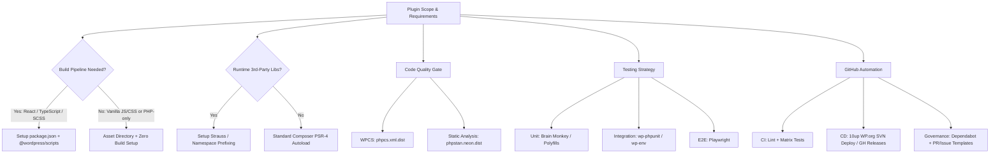

# WordPress Plugin GitHub Repository Specialist (`wp-github-repo-specialist`)

This skill provides comprehensive architectural guidelines, configuration blueprints, and automation workflows for creating and maintaining professional, enterprise-grade WordPress plugin repositories on GitHub.

---

## 1. Quick Assessment & Audit Workflow

When auditing or scaffolding a WordPress plugin repository on GitHub, evaluate the project against these 6 core pillars:



---

## 2. The Decision Matrix: When to Include vs. When NOT to Include

One of the most common pitfalls in WordPress plugin development is **over-engineering** (introducing bloated toolchains for simple plugins) or **under-engineering** (omitting prefixing or static analysis in complex plugins). Use this matrix to select the right stack:

| Component / Tool | When to INCLUDE | When NOT to Include (Overhead / Unnecessary) | Recommended Alternative |
| :--- | :--- | :--- | :--- |
| **Composer (PSR-4)** | Plugin has >3 classes, uses modern OOP, namespaces, or needs PHPStan / PHPUnit dev dependencies. | Single-file micro-plugin (<150 LOC) with procedural hooks. | Single entry-point file with standard hook callbacks. |
| **Strauss / PHP-Scoper** | Plugin uses runtime 3rd-party Composer packages (e.g., Guzzle, Stripe SDK, Monolog, Carbon) distributed to public/client sites. | Plugin has **no runtime dependencies** (Composer only used for `require-dev` tools like PHPCS/PHPStan). | Standard Composer autoloading without prefixing. |
| **npm / `@wordpress/scripts`** | Plugin includes Gutenberg custom blocks, React UI in admin/settings, TypeScript, or SASS/SCSS. | Plugin only uses 1-2 small vanilla JS/CSS files for toggle effects or light AJAX. | Place raw `.js` and `.css` directly in `assets/` or `public/`. |
| **`@wordpress/env` (`wp-env`)** | Plugin needs local containerized WordPress integration tests, multi-site testing, or Playwright E2E tests. | Team already uses a standardized Docker/DDEV/LocalWP workflow or only runs pure mock unit tests. | Brain Monkey / Mockery for isolated unit tests. |
| **Playwright E2E** | Complex custom block interactions, multi-step checkout/forms, full Gutenberg editor flows. | Simple shortcode/hook-based plugin without complex client-side interactive flows. | PHPUnit integration tests + manual smoke test. |
| **WordPress.org SVN Deploy Action** | Plugin is hosted on the official WordPress.org Plugin Directory. | Private, client-custom, or premium/commercial plugin sold outside WP.org. | GitHub Releases with attached `.zip` artifact via GH Actions. |
| **`.distignore`** | Plugin is deployed to WordPress.org SVN or packaged into release zips. | Monorepos or internal themes/plugins where raw git source is deployed directly. | Rely strictly on `.gitignore` and `.gitattributes`. |

---

## 3. Standard Repository File Architecture

A professional repository strictly separates **source code**, **dev/build tools**, and **distribution assets**:

```text
plugin-repository/
├── .github/                            # GitHub infrastructure
│   ├── ISSUE_TEMPLATE/                 # Structured bug/feature issue forms
│   │   ├── bug_report.yml
│   │   ├── feature_request.yml
│   │   └── config.yml
│   ├── workflows/                      # GitHub Actions CI/CD
│   │   ├── ci.yml                      # Matrix testing (PHP 7.4-8.3, WPCS, PHPStan)
│   │   ├── deploy-wporg.yml            # Automated WP.org SVN deployment (10up)
│   │   ├── release-gh.yml              # Clean zip packaging for GitHub Releases
│   │   └── dependabot.yml              # Dependency security scans
│   ├── PULL_REQUEST_TEMPLATE.md        # PR checklist & review guidelines
│   └── CODEOWNERS                      # Code ownership mapping
├── .wordpress-org/                     # WordPress.org asset directory (SVN /assets)
│   ├── banner-772x250.png              # Directory banner (standard)
│   ├── banner-1544x500.png             # Directory banner (retina)
│   ├── icon-128x128.png                # Plugin icon (standard)
│   ├── icon-256x256.png                # Plugin icon (retina)
│   └── screenshot-1.png                # Directory screenshots
├── assets/                             # Production frontend assets (or build/ for blocks)
│   ├── css/
│   └── js/
├── languages/                          # Translation files (.pot)
├── src/ or includes/                   # Namespaced PHP source files (PSR-4)
├── tests/                              # Automated test suites
│   ├── e2e/                            # Playwright end-to-end tests
│   ├── integration/                    # WP integration tests (database/core hooks)
│   ├── unit/                           # Isolated unit tests (Brain Monkey / Mocks)
│   └── bootstrap.php                   # Test bootstrap loader
├── .distignore                         # Files excluded from WP.org SVN / release zip
├── .editorconfig                       # Formatting rules (tabs for PHP, spaces for YAML/JSON)
├── .gitattributes                      # Line endings & export-ignore rules
├── .gitignore                          # Files excluded from git
├── .wp-env.json                        # (Optional) Local containerized WP test environment
├── CHANGELOG.md                        # Human-readable version history
├── composer.json                       # PHP dependencies, autoloading & scripts
├── composer.lock
├── LICENSE / LICENSE.txt               # GPLv2 or GPLv2-or-later license
├── package.json                        # (Optional) Node build scripts & dependencies
├── phpcs.xml.dist                      # WordPress Coding Standards configuration
├── phpstan.neon.dist                   # PHPStan static analysis configuration
├── phpunit.xml.dist                    # PHPUnit test suites configuration
├── playwright.config.ts                # (Optional) Playwright E2E configuration
├── README.md                           # GitHub developer documentation & badges
├── readme.txt                          # WordPress.org plugin directory specification
└── <plugin-slug>.php                   # Main plugin entry point (header declarations)
```

---

## 4. In-Depth Reference Guides

Explore the detailed references for battle-tested configurations and code templates:

*   **[CI/CD Workflows](file:///e:/DevCoding/Projects/WP%20Plugins/elynt-contact-cta-button/.agents/skills/wp-github-repo-specialist/references/ci-cd-workflows.md)**: Full GitHub Actions configs (`ci.yml`, `deploy-wporg.yml`, `release-gh.yml`, `dependabot.yml`).
*   **[Code Quality Configurations](file:///e:/DevCoding/Projects/WP%20Plugins/elynt-contact-cta-button/.agents/skills/wp-github-repo-specialist/references/code-quality-configs.md)**: `phpcs.xml.dist`, `phpstan.neon.dist`, `phpunit.xml.dist`, and `wp-env` setup.
*   **[Repository Governance & Metadata](file:///e:/DevCoding/Projects/WP%20Plugins/elynt-contact-cta-button/.agents/skills/wp-github-repo-specialist/references/repo-governance-templates.md)**: `.distignore`, `.gitattributes`, `.editorconfig`, dual `README.md` vs `readme.txt`, Issue & PR templates.
*   **[Dependency Isolation with Strauss](file:///e:/DevCoding/Projects/WP%20Plugins/elynt-contact-cta-button/.agents/skills/wp-github-repo-specialist/references/dependency-prefixing-guide.md)**: How to package 3rd-party libraries into `vendor-prefixed/` without dependency collision in WordPress.
*   **[Repository Archetype Blueprints](file:///e:/DevCoding/Projects/WP%20Plugins/elynt-contact-cta-button/.agents/skills/wp-github-repo-specialist/examples/repo-blueprints.md)**: 4 complete starter templates (Minimal Utility, Standard OOP, Gutenberg/Block, Enterprise).
