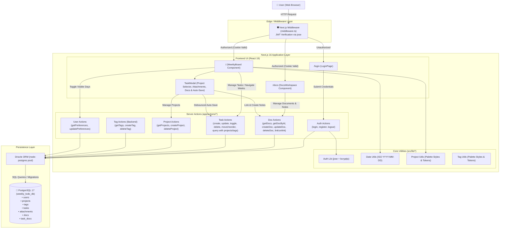

# Architecture Overview

**Weekly To-Do List** is a modern, responsive web application for weekly task management. Built with a **Modular Full-Stack Monolith** architecture utilizing **Next.js 16 (App Router)**, **React 19**, **Drizzle ORM**, and **PostgreSQL 17**, the application delivers a clean, glassmorphic light-themed user interface focused on cognitive simplicity, zero timezone drift, and seamless productivity.

---

## 1. Project Structure

```text
weekly-to-do-list/
├── src/
│   ├── app/                      # Next.js 16 App Router pages, layouts, and server actions
│   │   ├── actions/              # Typed Next.js Server Actions (RPC layer)
│   │   │   ├── attachments.ts    # Attachment actions (getTaskAttachments, uploadAttachment, deleteAttachment)
│   │   │   ├── auth.ts           # Authentication actions (login, register, logout)
│   │   │   ├── docs.ts           # Document actions (getUserDocs, getDocById, createDoc, updateDoc, deleteDoc, link/unlink task)
│   │   │   ├── projects.ts       # Project actions (getUserProjects, createProject, deleteProject)
│   │   │   ├── tags.ts           # Tag actions (getUserTags, createTag, deleteTag)
│   │   │   ├── tasks.ts          # Task actions (CRUD, status toggling, range querying, tag/project joins)
│   │   │   └── user.ts           # User preference actions (getUserPreferences, updateUserPreferences)
│   │   ├── api/                  # Next.js Route Handlers
│   │   │   └── attachments/      # Secure authenticated attachment retrieval
│   │   │       └── [id]/route.ts # Presigned R2 redirect/streaming route handler
│   │   ├── docs/                 # Document workspace routes (/docs and /docs/[id])
│   │   │   ├── [id]/             # Dynamic document route (/docs/[id])
│   │   │   │   └── page.tsx      # Deep link & direct document loader
│   │   │   └── page.tsx          # Master-detail docs workspace root
│   │   ├── login/                # Authentication route (/login)
│   │   │   └── page.tsx          # Login & registration glassmorphism card
│   │   ├── favicon.ico           # Application favicon
│   │   ├── globals.css           # Tailwind CSS v4 & custom glassmorphism styles
│   │   ├── layout.tsx            # Root HTML layout with Geist font configuration
│   │   └── page.tsx              # Protected root page (/) rendering the WeeklyBoard
│   ├── components/               # Reusable client and server UI components
│   │   ├── board/                # Weekly board modular subcomponents and drag-and-drop hook
│   │   │   ├── hooks/useBoardDnD.ts # Complete HTML5 drag and drop state and calculations
│   │   │   ├── DayColumn.tsx     # Column component for each day with dropzones and quick add
│   │   │   ├── TaskCard.tsx      # Reusable task card with badges, drag handles and subtask hierarchy
│   │   │   ├── UnscheduledSection.tsx # Collapsible backlog panel for unscheduled tasks
│   │   │   ├── ViewSettingsMenu.tsx # Popover menu for toggling Saturday/Sunday visibility
│   │   │   └── WeekNavControls.tsx # Week navigation controls (< Today >) and view settings popover
│   │   ├── docs/                 # Document management components and editor
│   │   │   ├── DocEditor.tsx     # Active document editor with title, project picker and autosave
│   │   │   ├── DocLinkedTasksSection.tsx # Linked tasks chips, jump and unlinking
│   │   │   ├── DocRichEditor.tsx # Full WYSIWYG editor with rich formatting toolbar via Tiptap
│   │   │   ├── DocsSidebar.tsx   # Sidebar with search, favorite/project filtering and doc list
│   │   │   └── DocsWorkspace.tsx # Responsive master-detail split-pane orchestrator
│   │   ├── shared/               # Universal polymorphic components shared across modules
│   │   │   ├── AttachmentsSection.tsx # Polymorphic attachment manager, R2 upload & cross-entity linker
│   │   │   └── ProjectSelector.tsx # Unified project picker dropdown and inline project creator
│   │   ├── task-modal/           # Task details modal specialized subcomponents
│   │   │   ├── TaskDocsSection.tsx # Linked docs chips, quick doc creation and doc linker popover
│   │   │   ├── TaskModalFooter.tsx # Modal footer with cascade delete confirmation
│   │   │   ├── TaskParentBanner.tsx # Visual banner for subtask parent linkage
│   │   │   ├── TaskScheduleInputs.tsx # Inline date, time, and natural duration inputs
│   │   │   ├── TaskSubtasksSection.tsx # Subtasks list, toggles, inline creation and deep links
│   │   │   └── TaskTagSelector.tsx # Tag picker dropdown (preserved for backend compatibility)
│   │   ├── AppHeader.tsx         # Unified glassmorphic application header with navigation tabs, theme toggle and logout
│   │   ├── TaskDescriptionEditor.tsx # WYSIWYG rich text editor powered by Tiptap with formatting toolbar
│   │   ├── TaskModal.tsx         # Task details modal orchestrator (< 500 lines)
│   │   └── WeeklyBoard.tsx       # Interactive weekly board orchestrator (< 500 lines)
│   ├── db/                       # Database connection and schema definitions
│   │   ├── index.ts              # PostgreSQL connection pool with Drizzle ORM client
│   │   └── schema.ts             # Drizzle table schemas (users, tags, tasks) and TypeScript types
│   ├── lib/                      # Core business logic, utilities, and helper functions
│   │   ├── hooks/                # Shared custom React hooks
│   │   │   ├── useDarkMode.ts    # useSyncExternalStore hook for zero-flicker dark mode sync
│   │   │   └── useTodayDateStr.ts # useSyncExternalStore hook for zero-mismatch today date string
│   │   ├── auth.ts               # JWT token signing/verification (jose) and bcryptjs password hashing
│   │   ├── date-utils.ts         # Timezone-immune date arithmetic and week interval formatters
│   │   ├── project-utils.ts      # Project color tokens and visual badge style helpers
│   │   ├── r2.ts                 # Cloudflare R2 S3 client, file path generator, and presigned URLs
│   │   └── tag-utils.ts          # Tag color tokens and visual badge style helpers
│   └── middleware.ts             # Edge middleware for route protection and auth redirection
├── tests/                       # Automated test suites and testing tiers
│   ├── README.md                 # Test suite documentation & architectural guide
│   └── unit/                     # Isolated unit tests (pure functions, zero I/O)
│       └── lib/                  # Unit tests for date-utils, r2, and auth
├── drizzle/                      # Drizzle Kit migration files and metadata
├── public/                       # Static public assets (SVG icons, logos)
├── compose.yaml                  # Multi-container Docker Compose orchestration (app, db)
├── Dockerfile                    # Production multi-stage Docker build
├── Dockerfile.dev                # Live development Dockerfile with hot-reloading
├── drizzle.config.ts             # Drizzle Kit configuration for migrations and studio
├── eslint.config.mjs             # ESLint flat configuration (Next.js & TypeScript rules)
├── next.config.ts                # Next.js framework configuration
├── package.json                  # Node.js dependencies, scripts, and package metadata
├── postcss.config.mjs            # PostCSS configuration for Tailwind CSS v4
├── tsconfig.json                 # TypeScript strict compiler configuration with '@/*' alias
└── vitest.config.ts              # Vitest test runner configuration with path aliases
```

---

## 2. High-Level System Diagram



---

## 3. Core Components

### 3.1. Frontend (`src/components/`, `src/app/`)
- **Stack**: Next.js (App Router), React 19, Tailwind CSS v4 (custom glassmorphism design tokens), `lucide-react`.
- **Main Views & Components**:
  - **`WeeklyBoard` (`src/components/WeeklyBoard.tsx`)**: Interactive weekly planner with HTML5 Drag & Drop, subtask nesting/reordering, week navigation, day visibility toggles, and persistent unscheduled backlog panel.
  - **`TaskModal` (`src/components/TaskModal.tsx`)**: Task details modal featuring Tiptap WYSIWYG editor (`TaskDescriptionEditor`), subtask hierarchy, project selector, attachments, and linked docs.
  - **`DocsWorkspace` (`src/components/docs/DocsWorkspace.tsx`)**: Split-pane notes/documentation workspace with Tiptap editor (`DocRichEditor`), search/filters, linked tasks, and attachments.
  - **`LoginPage` (`src/app/login/page.tsx`)**: Authentication card (login and registration with password visibility toggles).
- **UX Principles**: Inline grouping over deep card nesting, zero redundant labels/clutter, progressive disclosure via popovers, and transient mutation feedback (`Saving...`).

### 3.2. Backend & API (`src/app/actions/`, `src/app/api/`)
- **Server Actions (`src/app/actions/`)**: Direct Drizzle ORM mutations and queries for `tasks`, `docs`, `attachments`, `projects`, `tags`, `auth`, and `user` preferences.
- **Route Handlers (`src/app/api/`)**: `attachments/[id]` generates authenticated presigned Cloudflare R2 URLs for media access.
- **Middleware (`src/middleware.ts`)**: Edge runtime JWT session validation protecting root and authentication routes.
- *For detailed action signatures or component props, refer directly to the respective files in `src/app/actions/` and `src/components/`.*

---

## 4. Data Stores & Persistence

### 4.1. Primary Database & ORM
- **Engine**: PostgreSQL 17 (Alpine container).
- **ORM & Migrations**: Drizzle ORM (`drizzle-orm/node-postgres`) with Drizzle Kit (`npm run db:generate`, `npm run db:migrate`).
- **Connection Pool**: Cached connection pooling in development.

### 4.2. Database Models (`src/db/schema.ts`)
- **Entities**:
  - `users`: User credentials, authentication timestamps, and UI `preferences` (JSONB).
  - `tasks`: Weekly and unscheduled tasks, 1-level subtask hierarchy (`parent_id`), status, order, time, and tags/projects relations.
  - `docs`: Notes and documents with markdown/rich content, favorites, and project association.
  - `projects`: High-level initiatives and color categorization.
  - `tags`: Lightweight labels with palette color tags.
  - `attachments`: File metadata and Cloudflare R2 storage paths (`file_path`, `thumbnail_path`).
- **N:N Junction Tables**:
  - `task_docs`: Links documents to specific tasks.
  - `task_attachments`: Links uploaded attachments to tasks.
  - `doc_attachments`: Links uploaded attachments to documents.
- *For complete column definitions, constraints, indexes, and relations, refer directly to [`src/db/schema.ts`](./src/db/schema.ts).*

---

## 5. External Integrations & APIs

- **Object Storage (Cloudflare R2)**:
  - S3-compatible cloud object storage without egress fees.
  - Interfaced via `@aws-sdk/client-s3` and `@aws-sdk/s3-request-presigner`.
  - Enforces private bucket security model; objects accessed exclusively via authenticated signed URLs generated on-demand (`files/{attachmentId}/{fileName}`).
  - Automated physical file deletion on task and attachment removal.
- **Static Assets & Fonts**: Google Fonts (`Geist` and `Geist_Mono`) via `next/font/google`.

---

## 6. Deployment & Infrastructure

- **Containerization & Orchestration**:
  - **Local Development (`compose.yaml`)**: Docker Compose orchestrating two services:
    - `app` (`weekly-app`): Next.js application container via [`Dockerfile.dev`](./Dockerfile.dev) with Fast Refresh file synchronization (`docker compose watch` on `./src`, `./public`, `./drizzle`).
    - `db` (`weekly-db`): PostgreSQL 17 Alpine container with persistent volume `pgdata` and healthcheck (`pg_isready`).
  - **Production Docker (`Dockerfile`)**: Multi-stage standalone build with automated database migrations on container startup ([`scripts/migrate.mjs`](./scripts/migrate.mjs) via `drizzle-orm/node-postgres/migrator`), non-root `nextjs` security isolation, and portable compatibility with PaaS/container platforms (Easypanel, Coolify, Docker Compose, Cloud Run).
- **Database Migrations**: Handled automatically in production before Next.js server starts, with idempotent execution and connection retry logic.
- **Database GUI**: Drizzle Studio (`npm run db:studio` -> `https://local.drizzle.studio`).

---

## 7. Security & Authentication

- **Authentication Mechanism**: Session token encapsulated in an HTTP-only, `SameSite=Lax`, secure cookie (`auth_token`).
- **Token Signing**: JSON Web Tokens (JWT) signed and verified using `jose` with `HS256` symmetric algorithm and a configurable `AUTH_SECRET`.
- **Password Security**: One-way cryptographic hashing using `bcryptjs` (salt rounds = 10).
- **Data Protection & Isolation**: All task and tag queries and mutations strictly verify user session ownership via `session.userId` and enforce cascade deletion upon user removal.

---

## 8. Testing Strategy & Quality Assurance

- **Test Runner**: Vitest (`vitest@^3.2.7`) with `vite-tsconfig-paths` for native TypeScript execution, ESM compatibility, and `@/*` path alias resolution.
- **Architectural Tiers**:
  - **`tests/unit/`**: Fast, deterministic, zero-I/O unit tests executing in a lightweight Node environment. Focuses on mission-critical utilities:
    - `tests/unit/lib/date-utils.test.ts`: Timezone-immune date conversions, calendar range boundaries, and natural language duration parsing.
    - `tests/unit/lib/r2.test.ts`: Object storage key generation and filename sanitization against path traversal vulnerabilities.
    - `tests/unit/lib/auth.test.ts`: Bcrypt cryptographic hashing, salt generation, and JWT issuance/verification lifecycle.
  - **`tests/integration/`** *(Future)*: Planned tier for database transaction checks and Next.js Server Action mutations.
  - **`tests/e2e/`** *(Future)*: Planned tier for browser workflows via Playwright.
- **Execution Commands**:
  - `npm test`: Single-run suite execution (`vitest run`).
  - `npm run test:watch`: Interactive live development watch mode (`vitest`).


