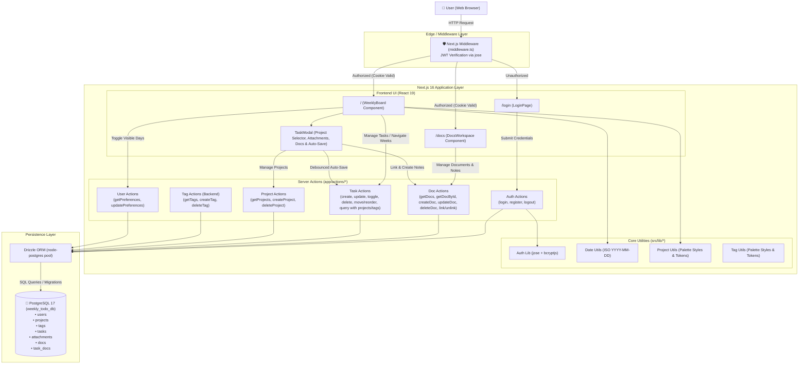

# Architecture Overview

**Weekly To-Do List** is a modern, responsive web application for weekly task management. Built with a **Modular Full-Stack Monolith** architecture utilizing **Next.js 16 (App Router)**, **React 19**, **Drizzle ORM**, and **PostgreSQL 17**, the application delivers a clean, glassmorphic light-themed user interface focused on cognitive simplicity, zero timezone drift, and seamless productivity.

---

## 1. Project Structure

```text
weekly-to-do-list/
├── src/
│   ├── app/                      # Next.js 16 App Router pages, layouts, and server actions
│   │   ├── actions/              # Typed Next.js Server Actions (RPC layer)
│   │   │   ├── attachments.ts    # Attachment actions (getTaskAttachments, uploadAttachment, deleteAttachment)
│   │   │   ├── auth.ts           # Authentication actions (login, register, logout)
│   │   │   ├── docs.ts           # Document actions (getUserDocs, getDocById, createDoc, updateDoc, deleteDoc, link/unlink task)
│   │   │   ├── projects.ts       # Project actions (getUserProjects, createProject, deleteProject)
│   │   │   ├── tags.ts           # Tag actions (getUserTags, createTag, deleteTag)
│   │   │   ├── tasks.ts          # Task actions (CRUD, status toggling, range querying, tag/project joins)
│   │   │   └── user.ts           # User preference actions (getUserPreferences, updateUserPreferences)
│   │   ├── api/                  # Next.js Route Handlers
│   │   │   └── attachments/      # Secure authenticated attachment retrieval
│   │   │       └── [id]/route.ts # Presigned R2 redirect/streaming route handler
│   │   ├── docs/                 # Document workspace routes (/docs and /docs/[id])
│   │   │   ├── [id]/             # Dynamic document route (/docs/[id])
│   │   │   │   └── page.tsx      # Deep link & direct document loader
│   │   │   └── page.tsx          # Master-detail docs workspace root
│   │   ├── login/                # Authentication route (/login)
│   │   │   └── page.tsx          # Login & registration glassmorphism card
│   │   ├── favicon.ico           # Application favicon
│   │   ├── globals.css           # Tailwind CSS v4 & custom glassmorphism styles
│   │   ├── layout.tsx            # Root HTML layout with Geist font configuration
│   │   └── page.tsx              # Protected root page (/) rendering the WeeklyBoard
│   ├── components/               # Reusable client and server UI components
│   │   ├── board/                # Weekly board modular subcomponents and drag-and-drop hook
│   │   │   ├── hooks/useBoardDnD.ts # Complete HTML5 drag and drop state and calculations
│   │   │   ├── DayColumn.tsx     # Column component for each day with dropzones and quick add
│   │   │   ├── TaskCard.tsx      # Reusable task card with badges, drag handles and subtask hierarchy
│   │   │   ├── UnscheduledSection.tsx # Collapsible backlog panel for unscheduled tasks
│   │   │   ├── ViewSettingsMenu.tsx # Popover menu for toggling Saturday/Sunday visibility
│   │   │   └── WeeklyHeader.tsx  # Board navigation header, date display, theme and logout
│   │   ├── docs/                 # Document management components and editor
│   │   │   ├── DocAttachmentsSection.tsx # Document attachments dropzone, multi-doc link picker & manager
│   │   │   ├── DocEditor.tsx     # Active document editor with title, project picker and autosave
│   │   │   ├── DocLinkedTasksSection.tsx # Linked tasks chips, jump and unlinking
│   │   │   ├── DocProjectSelector.tsx # Project picker dropdown for documents
│   │   │   ├── DocRichEditor.tsx # Full WYSIWYG editor with rich formatting toolbar via Tiptap
│   │   │   ├── DocsHeader.tsx    # Header with navigation tabs, theme toggle and logout
│   │   │   ├── DocsSidebar.tsx   # Sidebar with search, favorite/project filtering and doc list
│   │   │   └── DocsWorkspace.tsx # Responsive master-detail split-pane orchestrator
│   │   ├── task-modal/           # Task details modal specialized subcomponents
│   │   │   ├── TaskAttachmentsSection.tsx # Dropzone, image/PDF cards and attachment management
│   │   │   ├── TaskDocsSection.tsx # Linked docs chips, quick doc creation and doc linker popover
│   │   │   ├── TaskModalFooter.tsx # Modal footer with cascade delete confirmation
│   │   │   ├── TaskParentBanner.tsx # Visual banner for subtask parent linkage
│   │   │   ├── TaskScheduleInputs.tsx # Inline date, time, and natural duration inputs
│   │   │   ├── TaskSubtasksSection.tsx # Subtasks list, toggles, inline creation and deep links
│   │   │   ├── TaskProjectSelector.tsx # Project picker dropdown and inline project creator with color palette
│   │   │   └── TaskTagSelector.tsx # Tag picker dropdown (preserved for backend compatibility)
│   │   ├── TaskDescriptionEditor.tsx # WYSIWYG rich text editor powered by Tiptap with formatting toolbar
│   │   ├── TaskModal.tsx         # Task details modal orchestrator (< 500 lines)
│   │   └── WeeklyBoard.tsx       # Interactive weekly board orchestrator (< 500 lines)
│   ├── db/                       # Database connection and schema definitions
│   │   ├── index.ts              # PostgreSQL connection pool with Drizzle ORM client
│   │   └── schema.ts             # Drizzle table schemas (users, tags, tasks) and TypeScript types
│   ├── lib/                      # Core business logic, utilities, and helper functions
│   │   ├── hooks/                # Shared custom React hooks
│   │   │   ├── useDarkMode.ts    # useSyncExternalStore hook for zero-flicker dark mode sync
│   │   │   └── useTodayDateStr.ts # useSyncExternalStore hook for zero-mismatch today date string
│   │   ├── auth.ts               # JWT token signing/verification (jose) and bcryptjs password hashing
│   │   ├── date-utils.ts         # Timezone-immune date arithmetic and week interval formatters
│   │   ├── project-utils.ts      # Project color tokens and visual badge style helpers
│   │   ├── r2.ts                 # Cloudflare R2 S3 client, file path generator, and presigned URLs
│   │   └── tag-utils.ts          # Tag color tokens and visual badge style helpers
│   └── middleware.ts             # Edge middleware for route protection and auth redirection
├── drizzle/                      # Drizzle Kit migration files and metadata
├── public/                       # Static public assets (SVG icons, logos)
├── compose.yaml                  # Multi-container Docker Compose orchestration (app, db)
├── Dockerfile                    # Production multi-stage Docker build
├── Dockerfile.dev                # Live development Dockerfile with hot-reloading
├── drizzle.config.ts             # Drizzle Kit configuration for migrations and studio
├── eslint.config.mjs             # ESLint flat configuration (Next.js & TypeScript rules)
├── next.config.ts                # Next.js framework configuration
├── package.json                  # Node.js dependencies, scripts, and package metadata
├── postcss.config.mjs            # PostCSS configuration for Tailwind CSS v4
└── tsconfig.json                 # TypeScript strict compiler configuration with '@/*' alias
```

---

## 2. High-Level System Diagram



---

## 3. Core Components

### 3.1. Frontend / User Interfaces
- **Framework & Runtime**: Next.js 16.3 (App Router) with React 19.2.
- **Styling & Design System**: Tailwind CSS v4 with custom glassmorphism design tokens (`.glass-panel`, `.glass-card`, `.glass-card-today`, `.glass-input`), class-based dark mode (`@custom-variant dark`), anti-flicker script in root layout, and ambient multi-stop background gradients for both light and dark themes.
- **Icons**: `lucide-react` vector icons.
- **Key UI Modules**:
  - **`WeeklyBoard` (`src/components/WeeklyBoard.tsx`)**: Renders interactive weekly board with configurable day visibility (Saturday and Sunday hidden by default, toggled via glassmorphic View Popover), fast Dark Mode quick-toggle in the top header with `useSyncExternalStore` DOM synchronization, dynamic grid layout (5, 6, or 7 columns), highlights the current day ("Hoje"), provides week navigation buttons (Previous, Today, Next), renders tag badges per task, displays hierarchical same-day subtasks with indentation and guide lines, indicates cross-day subtasks with parent indicator pills, shows subtask completion progress counters (e.g. `1/3`), provides a persistent collapsible bottom panel for **"Tarefas sem data"** (continuous backlog with responsive grid and inline quick-add), supports optimistic inline task creation via `+ Nova tarefa`, and implements a fluid **Native HTML5 Drag and Drop** system allowing users to reorder tasks within a day, migrate tasks between days, move tasks bidirectionally between days and the unscheduled section, nest tasks as subtasks when dropped onto the center of another top-level task (enforcing the 1-level nesting limit), and drag subtasks out to day columns to make them independent.
  - **`TaskModal` (`src/components/TaskModal.tsx`)**: Self-contained details modal with tag selection & inline creation (8 palette colors with dark-mode variants), rich WYSIWYG description editor (`TaskDescriptionEditor` powered by Tiptap with dark theme support), linked documents section (`TaskDocsSection` supporting search, direct linking and inline creation of notes), debounced auto-save (600ms latency), date rescheduling picker, optional time setter (`HH:mm`), subtasks management section (quick inline creation with Enter, status toggle, date pills, deletion, and deep-link navigation), 1-level nesting enforcement, subtask parent header banner, and cascade deletion confirmation.
  - **`DocsWorkspace` (`src/components/docs/DocsWorkspace.tsx`)**: Split-pane master-detail documentation workspace with real-time text and content search, project filtering, favorites filtering, instant document creation, rich WYSIWYG note editing (`DocRichEditor` powered by Tiptap), linked tasks section, attachments management (`DocAttachmentsSection` with upload, N:N attachment linking across docs, unlinking, and R2 preview), and debounced auto-save.
  - **`LoginPage` (`src/app/login/page.tsx`)**: Minimalist authentication card with dark mode support, tab toggling between "Entrar" and "Criar Conta", password visibility toggle, and loading state transitions.
- **Clean UI & Cognitive Load Reduction (Mandatory across all views, layouts & components)**:
  - **Inline Over Container Nesting**: Avoid "card-inside-card" fatigue. Group related metadata and controls horizontally into compact inline rows (subtle pills, semantic icons) instead of nested wrappers or heavy borders.
  - **Zero Visual Clutter (No Meta-Labels or "(Opcional)")**: Omit static labels and optionality indicators when semantic icons, formatted values, or contextual placeholders self-describe the element.
  - **Progressive Disclosure**: Keep default surfaces high-signal and distraction-free. Expose secondary controls (tags, filters, configurations) via compact inline triggers, delegating complexity to ephemeral popovers.
  - **Transient-Only State Feedback**: Never render permanent static notices (e.g. "Salvo"). Display feedback exclusively during active mutations (e.g. animated `"Salvando..."`), returning to neutral/empty state once resolved.
  - **Top-Down Cognitive Hierarchy**: Sequence layout flow consistently: Primary Identity/Action -> Inline Metadata -> Core Content -> Nested/Relational Artifacts.

### 3.2. Backend Services & Server Actions
- **Architecture Pattern**: Next.js Server Actions with direct Drizzle ORM queries, optimistic client synchronization, and dedicated Route Handlers for binary media serving.
- **Key Action Modules**:
  - **`src/app/actions/attachments.ts`**: Provides `getTaskAttachmentsAction`, `getDocAttachmentsAction`, `uploadAttachmentAction` (multipart buffer upload to R2 for tasks or docs, MIME type and size validation, database persistence with automated rollback), `linkAttachmentToTaskAction`, `unlinkAttachmentFromTaskAction`, `getUserAvailableTaskAttachmentsAction`, `linkAttachmentToDocAction`, `unlinkAttachmentFromDocAction`, `getUserAvailableAttachmentsAction`, and `deleteAttachmentAction` (deletes object from R2 and removes database row).
  - **`src/app/actions/auth.ts`**: Handles registration (email uniqueness check, bcrypt hashing), login (password comparison, `lastLoginAt` update), and logout with HTTP-only cookie invalidation.
  - **`src/app/actions/docs.ts`**: Provides `getUserDocsAction`, `getDocByIdAction`, `createDocAction`, `updateDocAction`, `deleteDocAction`, `toggleDocFavoriteAction`, `getTaskDocsAction`, `linkDocToTaskAction`, `unlinkDocFromTaskAction`, and `createAndLinkDocAction`.
  - **`src/app/actions/tags.ts`**: Provides `getUserTagsAction`, `createTagAction` (color-validated), and `deleteTagAction`.
  - **`src/app/actions/tasks.ts`**: Provides `getWeekTasksAction` (ordered by `tasks.order` and `tasks.createdAt`, joined with `tags`, aliased parent `tasks`, aggregating subtask and attachment stats), `getSubtasksAction`, `getTaskByIdAction`, `createTaskAction`, `toggleTaskStatusAction`, `updateTaskAction`, `deleteTaskAction` (with cascade deletion of child subtasks and batch physical cleanup of unshared attachments from Cloudflare R2), and `moveOrReorderTasksAction`.
  - **`src/app/actions/user.ts`**: Provides `getUserPreferencesAction` and `updateUserPreferencesAction` for user-level JSON preferences persistence (e.g. `showSaturday`, `showSunday`, `theme`).
- **Route Handlers**:
  - **`src/app/api/attachments/[id]/route.ts`**: Authenticated GET endpoint validating session and attachment ownership, redirecting (HTTP 307) to expiring presigned Cloudflare R2 URLs for secure in-browser viewing or download.
- **Route Middleware (`src/middleware.ts`)**: Intercepts requests on the Edge runtime, decrypts and validates JWT session tokens from the `auth_token` cookie, preventing unauthorized access to `/` and redirecting authenticated users away from `/login`.

---

## 4. Data Stores & Persistence

### 4.1. Primary Database
- **Database Engine**: PostgreSQL 17 (running in an isolated Alpine container).
- **ORM / Query Builder**: Drizzle ORM (`drizzle-orm/node-postgres`) with cached connection pooling in development.
- **Migration Engine**: Drizzle Kit (`drizzle-kit generate` & `drizzle-kit migrate`).

### 4.2. Database Schemas (`src/db/schema.ts`)
- **`users` Table**:
  - `id` (`uuid`, Primary Key, `defaultRandom()`)
  - `email` (`varchar(255)`, Unique, Not Null)
  - `password_hash` (`text`, Not Null)
  - `preferences` (`jsonb`, Default `{"showSaturday":false,"showSunday":false,"theme":"light"}`, Not Null) — *Extensible JSON storage for user UI settings and configs (visible days, theme).*
  - `created_at` (`timestamp with time zone`, `defaultNow()`, Not Null)
  - `last_login_at` (`timestamp with time zone`, Nullable)
- **`tags` Table (Preserved on backend)**:
  - `id` (`uuid`, Primary Key, `defaultRandom()`)
  - `user_id` (`uuid`, Foreign Key -> `users.id`, `onDelete: 'cascade'`, Not Null)
  - `name` (`varchar(50)`, Not Null)
  - `color` (`varchar(30)`, Default `'indigo'`, Not Null)
  - `created_at` (`timestamp with time zone`, `defaultNow()`, Not Null)
  - `updated_at` (`timestamp with time zone`, `defaultNow()`, Not Null)
- **`projects` Table**:
  - `id` (`uuid`, Primary Key, `defaultRandom()`)
  - `user_id` (`uuid`, Foreign Key -> `users.id`, `onDelete: 'cascade'`, Not Null)
  - `name` (`varchar(50)`, Not Null)
  - `color` (`varchar(30)`, Default `'indigo'`, Not Null)
  - `created_at` (`timestamp with time zone`, `defaultNow()`, Not Null)
  - `updated_at` (`timestamp with time zone`, `defaultNow()`, Not Null)
- **`tasks` Table**:
  - `id` (`uuid`, Primary Key, `defaultRandom()`)
  - `user_id` (`uuid`, Foreign Key -> `users.id`, `onDelete: 'cascade'`, Not Null)
  - `tag_id` (`uuid`, Foreign Key -> `tags.id`, `onDelete: 'set null'`, Nullable)
  - `project_id` (`uuid`, Foreign Key -> `projects.id`, `onDelete: 'set null'`, Nullable)
  - `parent_id` (`uuid`, Foreign Key -> `tasks.id`, `onDelete: 'cascade'`, Nullable) — *Enables 1-level hierarchical subtasks.*
  - `title` (`varchar(500)`, Not Null)
  - `content` (`text`, Default `""`, Not Null)
  - `date` (`date`, Format `'YYYY-MM-DD'`, Nullable) — *Guarantees total immunity against client/server timezone offsets; nullable for unscheduled tasks / global backlog.*
  - `time` (`varchar(5)`, Format `'HH:mm'`, Nullable)
  - `duration` (`integer`, Estimated duration in total minutes, Nullable)
  - `completed` (`boolean`, Default `false`, Not Null)
  - `order` (`integer`, Default `0`, Not Null) — *Determines custom ordering within day columns and subtask lists.*
  - `created_at` (`timestamp with time zone`, `defaultNow()`, Not Null)
  - `updated_at` (`timestamp with time zone`, `defaultNow()`, Not Null)
- **`attachments` Table**:
  - `id` (`uuid`, Primary Key, `defaultRandom()`)
  - `task_id` (`uuid`, Foreign Key -> `tasks.id`, `onDelete: 'set null'`, Nullable) — *Nullable to support attachments uploaded directly to docs or shared across multiple documents/tasks.*
  - `user_id` (`uuid`, Foreign Key -> `users.id`, `onDelete: 'cascade'`, Not Null)
  - `file_name` (`varchar(255)`, Original filename for UI display, Not Null)
  - `file_path` (`text`, Relative object path in Cloudflare R2 e.g. `files/{attachmentId}/{sanitizedFileName}`, Not Null)
  - `thumbnail_path` (`text`, Relative thumbnail path in Cloudflare R2 e.g. `files/{attachmentId}/thumb.webp`, Nullable)
  - `content_type` (`varchar(100)`, MIME type e.g. `image/png`, `application/pdf`, Not Null)
  - `file_size` (`integer`, File size in bytes, Not Null)
  - `created_at` (`timestamp with time zone`, `defaultNow()`, Not Null)
  - `updated_at` (`timestamp with time zone`, `defaultNow()`, Not Null)
  - *Indexes*: `attachments_task_id_idx` on `task_id`, `attachments_user_id_idx` on `user_id`.
- **`docs` Table**:
  - `id` (`uuid`, Primary Key, `defaultRandom()`)
  - `user_id` (`uuid`, Foreign Key -> `users.id`, `onDelete: 'cascade'`, Not Null)
  - `project_id` (`uuid`, Foreign Key -> `projects.id`, `onDelete: 'set null'`, Nullable)
  - `title` (`varchar(255)`, Default `'Untitled Document'`, Not Null)
  - `content` (`text`, Default `""`, Not Null)
  - `is_favorite` (`boolean`, Default `false`, Not Null)
  - `created_at` (`timestamp with time zone`, `defaultNow()`, Not Null)
  - `updated_at` (`timestamp with time zone`, `defaultNow()`, Not Null)
  - *Indexes*: `docs_user_id_idx` on `user_id`, `docs_project_id_idx` on `project_id`, `docs_favorite_idx` on `(user_id, is_favorite)`.
- **`task_docs` Table (N:N Associative)**:
  - `id` (`uuid`, Primary Key, `defaultRandom()`)
  - `task_id` (`uuid`, Foreign Key -> `tasks.id`, `onDelete: 'cascade'`, Not Null)
  - `doc_id` (`uuid`, Foreign Key -> `docs.id`, `onDelete: 'cascade'`, Not Null)
  - `user_id` (`uuid`, Foreign Key -> `users.id`, `onDelete: 'cascade'`, Not Null)
  - `created_at` (`timestamp with time zone`, `defaultNow()`, Not Null)
  - *Indexes*: `task_docs_task_doc_unique_idx` unique on `(task_id, doc_id)`, `task_docs_task_id_idx` on `task_id`, `task_docs_doc_id_idx` on `doc_id`, `task_docs_user_id_idx` on `user_id`.
- **`task_attachments` Table (N:N Associative)**:
  - `id` (`uuid`, Primary Key, `defaultRandom()`)
  - `task_id` (`uuid`, Foreign Key -> `tasks.id`, `onDelete: 'cascade'`, Not Null)
  - `attachment_id` (`uuid`, Foreign Key -> `attachments.id`, `onDelete: 'cascade'`, Not Null)
  - `user_id` (`uuid`, Foreign Key -> `users.id`, `onDelete: 'cascade'`, Not Null)
  - `created_at` (`timestamp with time zone`, `defaultNow()`, Not Null)
  - *Indexes*: `task_attachments_task_attachment_unique_idx` unique on `(task_id, attachment_id)`, `task_attachments_task_id_idx` on `task_id`, `task_attachments_attachment_id_idx` on `attachment_id`, `task_attachments_user_id_idx` on `user_id`.
- **`doc_attachments` Table (N:N Associative)**:
  - `id` (`uuid`, Primary Key, `defaultRandom()`)
  - `doc_id` (`uuid`, Foreign Key -> `docs.id`, `onDelete: 'cascade'`, Not Null)
  - `attachment_id` (`uuid`, Foreign Key -> `attachments.id`, `onDelete: 'cascade'`, Not Null)
  - `user_id` (`uuid`, Foreign Key -> `users.id`, `onDelete: 'cascade'`, Not Null)
  - `created_at` (`timestamp with time zone`, `defaultNow()`, Not Null)
  - *Indexes*: `doc_attachments_doc_attachment_unique_idx` unique on `(doc_id, attachment_id)`, `doc_attachments_doc_id_idx` on `doc_id`, `doc_attachments_attachment_id_idx` on `attachment_id`, `doc_attachments_user_id_idx` on `user_id`.

---

## 5. External Integrations & APIs

- **Object Storage (Cloudflare R2)**:
  - S3-compatible cloud object storage without egress fees.
  - Interfaced via `@aws-sdk/client-s3` and `@aws-sdk/s3-request-presigner`.
  - Enforces private bucket security model; objects accessed exclusively via authenticated signed URLs generated on-demand (`files/{attachmentId}/{fileName}`).
  - Automated physical file deletion on task and attachment removal.
- **Static Assets & Fonts**: Google Fonts (`Geist` and `Geist_Mono`) via `next/font/google`.

---

## 6. Deployment & Infrastructure

- **Containerization & Orchestration**:
  - **Local Development (`compose.yaml`)**: Docker Compose orchestrating two services:
    - `app` (`weekly-app`): Next.js application container via [`Dockerfile.dev`](file:///e:/DevCoding/Projects/Node/weekly-to-do-list/Dockerfile.dev) with Fast Refresh file synchronization (`docker compose watch` on `./src`, `./public`, `./drizzle`).
    - `db` (`weekly-db`): PostgreSQL 17 Alpine container with persistent volume `pgdata` and healthcheck (`pg_isready`).
  - **Production Docker (`Dockerfile`)**: Multi-stage standalone build with automated database migrations on container startup ([`scripts/migrate.mjs`](file:///e:/DevCoding/Projects/Node/weekly-to-do-list/scripts/migrate.mjs) via `drizzle-orm/node-postgres/migrator`), non-root `nextjs` security isolation, and portable compatibility with PaaS/container platforms (Easypanel, Coolify, Docker Compose, Cloud Run).
- **Database Migrations**: Handled automatically in production before Next.js server starts, with idempotent execution and connection retry logic.
- **Database GUI**: Drizzle Studio (`npm run db:studio` -> `https://local.drizzle.studio`).

---

## 7. Security & Authentication

- **Authentication Mechanism**: Session token encapsulated in an HTTP-only, `SameSite=Lax`, secure cookie (`auth_token`).
- **Token Signing**: JSON Web Tokens (JWT) signed and verified using `jose` with `HS256` symmetric algorithm and a configurable `AUTH_SECRET`.
- **Password Security**: One-way cryptographic hashing using `bcryptjs` (salt rounds = 10).
- **Data Protection & Isolation**: All task and tag queries and mutations strictly verify user session ownership via `session.userId` and enforce cascade deletion upon user removal.

