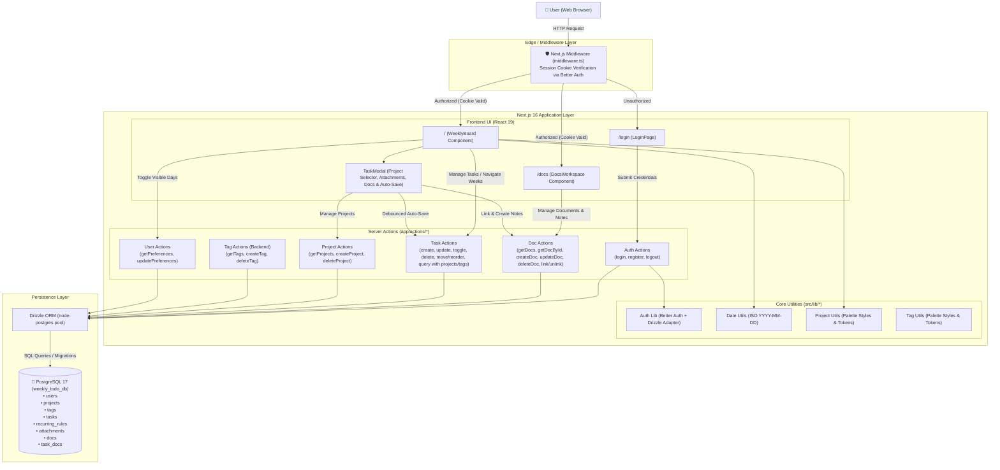

# Architecture Overview

**Weekly To-Do List** is a modern, responsive web application for weekly task management. Built with a **Modular Full-Stack Monolith** architecture utilizing **Next.js 16 (App Router)**, **React 19**, **Drizzle ORM**, and **PostgreSQL 17**, the application delivers a clean, glassmorphic light-themed user interface focused on cognitive simplicity, zero timezone drift, and seamless productivity.

---

## 1. Directory Conventions

High-signal architectural boundaries and folder responsibilities:

- **`src/app/actions/`**: Typed Next.js Server Actions acting as the primary RPC layer for queries, mutations, and business logic.
- **`src/app/api/`**: Next.js Route Handlers reserved for streaming, webhooks, authenticated binary transfers (e.g. presigned Cloudflare R2 attachment redirects), and Better Auth endpoints (`api/auth/[...all]`).
- **`src/app/(routes)/`**: Next.js App Router pages, dynamic routes, and layouts.
- **`src/components/`**: Reusable React 19 UI components modularized by domain.
- **`src/db/`**: Persistence configuration with PostgreSQL connection pooling (`index.ts`) and Drizzle ORM schemas and relations (`schema.ts`).
- **`src/lib/`**: Core utilities, Better Auth configuration, timezone-immune date arithmetic, Cloudflare R2 client, and shared React hooks.
- **`src/middleware.ts`**: Edge runtime middleware enforcing session cookie validation via Better Auth and route protection.
- **`tests/`**: Automated test suites.
- **`drizzle/`**: Auto-generated Drizzle Kit migration SQL files and schema snapshots.

> **Note**: For individual component props, action signatures, or utility implementations, refer directly to source files via LSP or search tools (`ripgrep`) rather than maintaining an exhaustive static file list.

---

## 2. High-Level System Diagram

---

## 3. Core Components

### 3.1. Frontend (`src/components/`, `src/app/`)
- **Stack**: Next.js (App Router), React 19, Tailwind CSS v4 (custom glassmorphism design tokens), `lucide-react`.
- **Main Views & Components**:
  - **`WeeklyBoard` (`src/components/WeeklyBoard.tsx`)**: Interactive weekly planner with HTML5 Drag & Drop, subtask nesting/reordering, week navigation, day visibility toggles, and persistent unscheduled backlog panel.
  - **`TaskModal` (`src/components/TaskModal.tsx`)**: Task details modal featuring Tiptap WYSIWYG editor (`TaskDescriptionEditor`), subtask hierarchy, project selector, attachments, and linked docs.
  - **`DocsWorkspace` (`src/components/docs/DocsWorkspace.tsx`)**: Split-pane notes/documentation workspace with Tiptap editor (`DocRichEditor`), search/filters, linked tasks, and attachments.
  - **`LoginPage` (`src/app/login/page.tsx`)**: Authentication card (login and registration with password visibility toggles).
- **UX Principles**: Inline grouping over deep card nesting, zero redundant labels/clutter, progressive disclosure via popovers, and transient mutation feedback (`Saving...`).

### 3.2. Backend & API (`src/app/actions/`, `src/app/api/`)
- **Server Actions (`src/app/actions/`)**: Direct Drizzle ORM mutations and queries for `tasks`, `docs`, `attachments`, `projects`, `tags`, `auth` (Better Auth instance API integration), and `user` preferences.
- **Route Handlers (`src/app/api/`)**: `attachments/[id]` generates authenticated presigned Cloudflare R2 URLs for media access; `auth/[...all]` serves Better Auth HTTP API endpoints via `toNextJsHandler`.
- **Middleware (`src/middleware.ts`)**: Edge runtime session cookie validation (`better-auth/cookies`) protecting root and authentication routes.
- *For detailed action signatures or component props, refer directly to the respective files in `src/app/actions/` and `src/components/`.*

---

## 4. Data Stores & Persistence

### 4.1. Primary Database & ORM
- **Engine**: PostgreSQL 17 (Alpine container).
- **ORM & Migrations**: Drizzle ORM (`drizzle-orm/node-postgres`) with Drizzle Kit (`npm run db:generate`, `npm run db:migrate`).
- **Connection Pool**: Cached connection pooling in development.

### 4.2. Domain Models & Schema

The data model is user-scoped (`session.userId`), centered around four primary aggregates:
- **Authentication & Sessions**: Better Auth managed tables (`users`, `sessions`, `accounts`, `verifications`) with custom user fields (`preferences`, `last_login_at`) and UUID primary keys.
- **Tasks & Recurrence**: Weekly scheduled or backlog items supporting a 1-level subtask hierarchy (`parent_id`), natural duration, and project/tag relations. Recurring routines are managed via `recurring_rules` using an on-demand window projection strategy: instances are materialized as discrete rows in `tasks` with `recurringRuleId` and `originalDate`, preserving independent completion status while supporting scoped edits ("This occurrence" vs "This and future") and deletions ("This", "Future", "All").
- **Documents & Attachments**: Rich-text workspace notes and Cloudflare R2 file attachments linked polymorphically to tasks and docs.

> **Single Source of Truth**: All table schemas, foreign key constraints, indexes, and Drizzle relational mappings are defined strictly in [`src/db/schema.ts`](./src/db/schema.ts). Always inspect that file directly before writing database queries or migrations.

---

## 5. External Integrations & APIs

- **Object Storage (Cloudflare R2)**:
  - S3-compatible cloud object storage without egress fees.
  - Interfaced via `@aws-sdk/client-s3` and `@aws-sdk/s3-request-presigner`.
  - Enforces private bucket security model; objects accessed exclusively via authenticated signed URLs generated on-demand (`files/{attachmentId}/{fileName}`).
  - Automated physical file deletion on task and attachment removal.
- **Static Assets & Fonts**: Google Fonts (`Geist` and `Geist_Mono`) via `next/font/google`.

---

## 6. Security & Authentication

- **Authentication Mechanism**: Session-based authentication managed by **Better Auth** (`better-auth` + `@better-auth/drizzle-adapter`). Session tokens stored in signed, HTTP-only, `SameSite=Lax`, secure cookies (`better-auth.session_token`).
- **Session & Account Storage**: Persisted in PostgreSQL database tables (`sessions`, `accounts`, `verifications`, and `users`), using UUID primary keys and standard Drizzle schema relations.
- **Password Security**: Managed internally by Better Auth via standard one-way password hashing (Scrypt/bcrypt).
- **Edge Middleware Protection**: Fast cookie presence check via `getSessionCookie(request)` from `better-auth/cookies` without cold-start database roundtrips on edge route transitions.
- **Multi-Tenant Data Protection & Isolation**: All task, document, and tag queries and mutations strictly verify user session ownership via `getSessionUser()` (`session.userId`) and enforce cascade deletion upon user removal.

