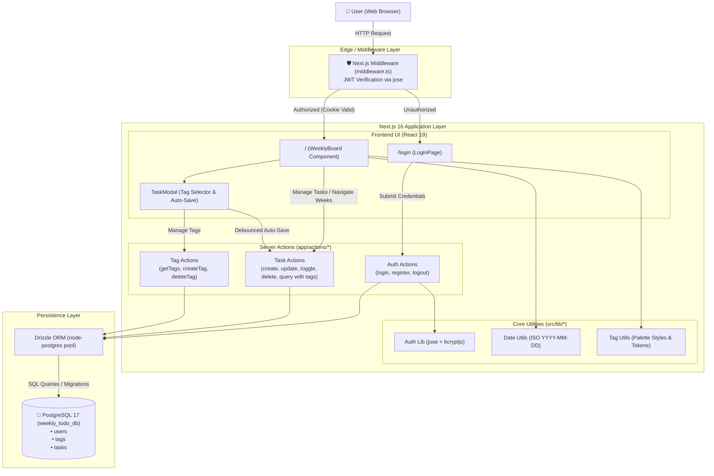

# Architecture Overview

**Weekly To-Do List** is a modern, responsive web application for weekly task management. Built with a **Modular Full-Stack Monolith** architecture utilizing **Next.js 16 (App Router)**, **React 19**, **Drizzle ORM**, and **PostgreSQL 17**, the application delivers a clean, glassmorphic light-themed user interface focused on cognitive simplicity, zero timezone drift, and seamless productivity.

---

## 1. Project Structure

```text
weekly-to-do-list/
├── src/
│   ├── app/                      # Next.js 16 App Router pages, layouts, and server actions
│   │   ├── actions/              # Typed Next.js Server Actions (RPC layer)
│   │   │   ├── auth.ts           # Authentication actions (login, register, logout)
│   │   │   ├── tags.ts           # Tag actions (getUserTags, createTag, deleteTag)
│   │   │   └── tasks.ts          # Task actions (CRUD, status toggling, range querying, tag joins)
│   │   ├── login/                # Authentication route (/login)
│   │   │   └── page.tsx          # Login & registration glassmorphism card
│   │   ├── favicon.ico           # Application favicon
│   │   ├── globals.css           # Tailwind CSS v4 & custom glassmorphism styles
│   │   ├── layout.tsx            # Root HTML layout with Geist font configuration
│   │   └── page.tsx              # Protected root page (/) rendering the WeeklyBoard
│   ├── components/               # Reusable client and server UI components
│   │   ├── TaskModal.tsx         # Task details modal with tag selection/creation, auto-resize textarea & auto-save
│   │   └── WeeklyBoard.tsx       # 7-day interactive weekly board with tag badges
│   ├── db/                       # Database connection and schema definitions
│   │   ├── index.ts              # PostgreSQL connection pool with Drizzle ORM client
│   │   └── schema.ts             # Drizzle table schemas (users, tags, tasks) and TypeScript types
│   ├── lib/                      # Core business logic, utilities, and helper functions
│   │   ├── auth.ts               # JWT token signing/verification (jose) and bcryptjs password hashing
│   │   ├── date-utils.ts         # Timezone-immune date arithmetic and week interval formatters
│   │   └── tag-utils.ts          # Tag color tokens and visual badge style helpers
│   └── middleware.ts             # Edge middleware for route protection and auth redirection
├── drizzle/                      # Drizzle Kit migration files and metadata
│   ├── 0000_funny_marvel_boy.sql # Initial schema migration (users, tasks)
│   ├── 0001_green_jackpot.sql    # Schema migration for tags table & tasks.tag_id
│   └── meta/                     # Migration snapshots and journals
├── public/                       # Static public assets (SVG icons, logos)
├── compose.yaml                  # Multi-container Docker Compose orchestration (app, db)
├── Dockerfile                    # Production multi-stage Docker build
├── Dockerfile.dev                # Live development Dockerfile with hot-reloading
├── drizzle.config.ts             # Drizzle Kit configuration for migrations and studio
├── eslint.config.mjs             # ESLint flat configuration (Next.js & TypeScript rules)
├── next.config.ts                # Next.js framework configuration
├── package.json                  # Node.js dependencies, scripts, and package metadata
├── postcss.config.mjs            # PostCSS configuration for Tailwind CSS v4
└── tsconfig.json                 # TypeScript strict compiler configuration with '@/*' alias
```

---

## 2. High-Level System Diagram



---

## 3. Core Components

### 3.1. Frontend / User Interfaces
- **Framework & Runtime**: Next.js 16.3 (App Router) with React 19.2.
- **Styling & Design System**: Tailwind CSS v4 with custom glassmorphism design tokens (`.glass-panel`, `.glass-card`, `.glass-card-today`, `.glass-input`) and ambient multi-stop background gradients.
- **Icons**: `lucide-react` vector icons.
- **Key UI Modules**:
  - **`WeeklyBoard` (`src/components/WeeklyBoard.tsx`)**: Renders 7 columns starting on Monday, highlights the current day ("Hoje"), provides week navigation buttons (Previous, Today, Next), renders tag badges per task, and supports optimistic inline task creation via `+ Nova tarefa`.
  - **`TaskModal` (`src/components/TaskModal.tsx`)**: Self-contained details modal with tag selection & inline creation (8 palette colors), auto-resizing textarea, debounced auto-save (600ms latency), date rescheduling picker, optional time setter (`HH:mm`), and deletion confirmation.
  - **`LoginPage` (`src/app/login/page.tsx`)**: Minimalist authentication card with tab toggling between "Entrar" and "Criar Conta", password visibility toggle, and loading state transitions.

### 3.2. Backend Services & Server Actions
- **Architecture Pattern**: Next.js Server Actions with direct Drizzle ORM queries and optimistic client synchronization.
- **Key Action Modules**:
  - **`src/app/actions/auth.ts`**: Handles registration (email uniqueness check, bcrypt hashing), login (password comparison, `lastLoginAt` update), and logout with HTTP-only cookie invalidation.
  - **`src/app/actions/tags.ts`**: Provides `getUserTagsAction`, `createTagAction` (color-validated), and `deleteTagAction`.
  - **`src/app/actions/tasks.ts`**: Provides `getWeekTasksAction` (joined with `tags` table), `createTaskAction`, `toggleTaskStatusAction`, `updateTaskAction` (partial updates for auto-save and tag assignment), and `deleteTaskAction`.
- **Route Middleware (`src/middleware.ts`)**: Intercepts requests on the Edge runtime, decrypts and validates JWT session tokens from the `auth_token` cookie, preventing unauthorized access to `/` and redirecting authenticated users away from `/login`.

---

## 4. Data Stores & Persistence

### 4.1. Primary Database
- **Database Engine**: PostgreSQL 17 (running in an isolated Alpine container).
- **ORM / Query Builder**: Drizzle ORM (`drizzle-orm/node-postgres`) with cached connection pooling in development.
- **Migration Engine**: Drizzle Kit (`drizzle-kit generate` & `drizzle-kit migrate`).

### 4.2. Database Schemas (`src/db/schema.ts`)
- **`users` Table**:
  - `id` (`uuid`, Primary Key, `defaultRandom()`)
  - `email` (`varchar(255)`, Unique, Not Null)
  - `password_hash` (`text`, Not Null)
  - `created_at` (`timestamp with time zone`, `defaultNow()`, Not Null)
  - `last_login_at` (`timestamp with time zone`, Nullable)
- **`tags` Table**:
  - `id` (`uuid`, Primary Key, `defaultRandom()`)
  - `user_id` (`uuid`, Foreign Key -> `users.id`, `onDelete: 'cascade'`, Not Null)
  - `name` (`varchar(50)`, Not Null)
  - `color` (`varchar(30)`, Default `'indigo'`, Not Null)
  - `created_at` (`timestamp with time zone`, `defaultNow()`, Not Null)
  - `updated_at` (`timestamp with time zone`, `defaultNow()`, Not Null)
- **`tasks` Table**:
  - `id` (`uuid`, Primary Key, `defaultRandom()`)
  - `user_id` (`uuid`, Foreign Key -> `users.id`, `onDelete: 'cascade'`, Not Null)
  - `tag_id` (`uuid`, Foreign Key -> `tags.id`, `onDelete: 'set null'`, Nullable)
  - `title` (`varchar(500)`, Not Null)
  - `content` (`text`, Default `""`, Not Null)
  - `date` (`date`, Format `'YYYY-MM-DD'`, Not Null) — *Guarantees total immunity against client/server timezone offsets.*
  - `time` (`varchar(5)`, Format `'HH:mm'`, Nullable)
  - `duration` (`integer`, Estimated duration in total minutes, Nullable)
  - `completed` (`boolean`, Default `false`, Not Null)
  - `created_at` (`timestamp with time zone`, `defaultNow()`, Not Null)
  - `updated_at` (`timestamp with time zone`, `defaultNow()`, Not Null)

---

## 5. External Integrations & APIs

- **External Third-Party APIs**: N/A (Self-contained standalone application).
- **Static Assets & Fonts**: Google Fonts (`Geist` and `Geist_Mono`) via `next/font/google`.

---

## 6. Deployment & Infrastructure

- **Containerization**: Docker Compose (`compose.yaml`) orchestrating two healthy services:
  - `app` (`weekly-app`): Next.js application container with Fast Refresh file synchronization (`docker compose watch` on `./src`, `./public`, `./drizzle`).
  - `db` (`weekly-db`): PostgreSQL 17 Alpine container with persistent volume `pgdata` and healthcheck (`pg_isready`).
- **Database GUI**: Drizzle Studio (`npm run db:studio` -> `https://local.drizzle.studio`).

---

## 7. Security & Authentication

- **Authentication Mechanism**: Session token encapsulated in an HTTP-only, `SameSite=Lax`, secure cookie (`auth_token`).
- **Token Signing**: JSON Web Tokens (JWT) signed and verified using `jose` with `HS256` symmetric algorithm and a configurable `AUTH_SECRET`.
- **Password Security**: One-way cryptographic hashing using `bcryptjs` (salt rounds = 10).
- **Data Protection & Isolation**: All task and tag queries and mutations strictly verify user session ownership via `session.userId` and enforce cascade deletion upon user removal.

